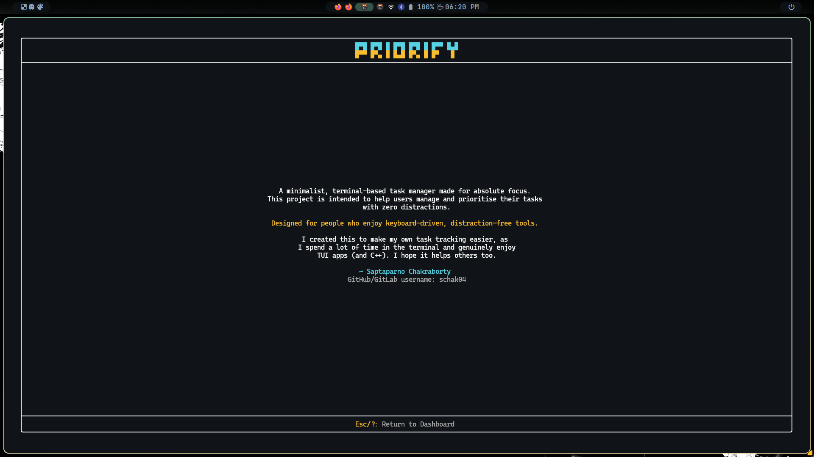
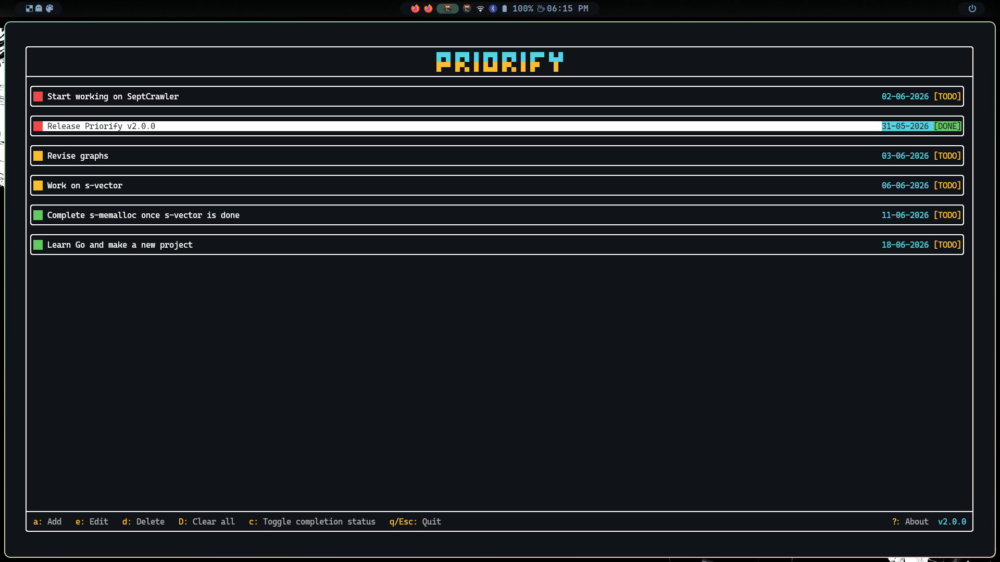
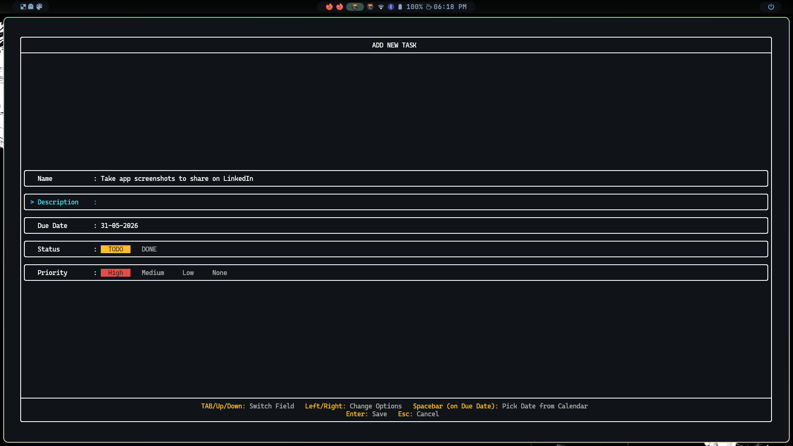
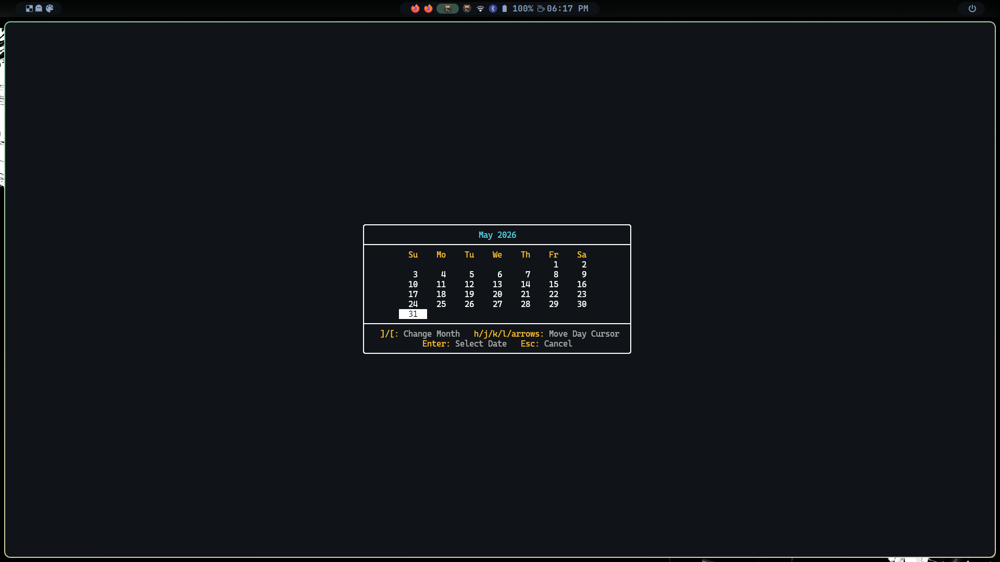
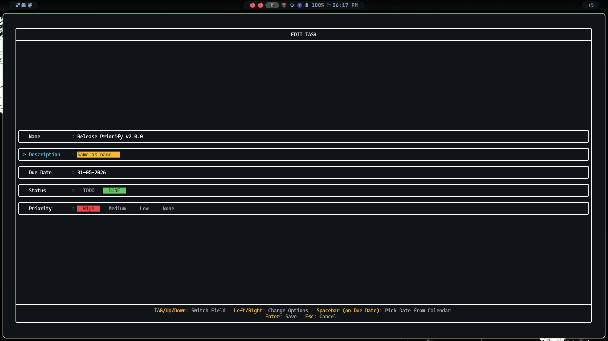
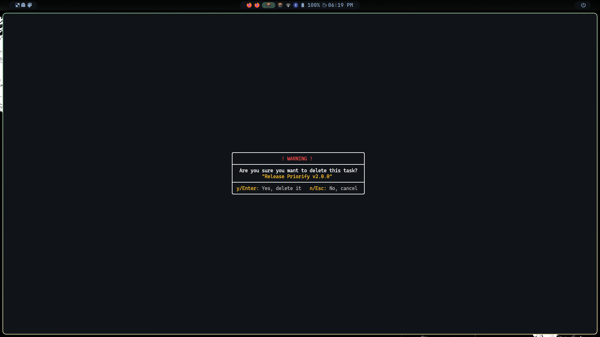
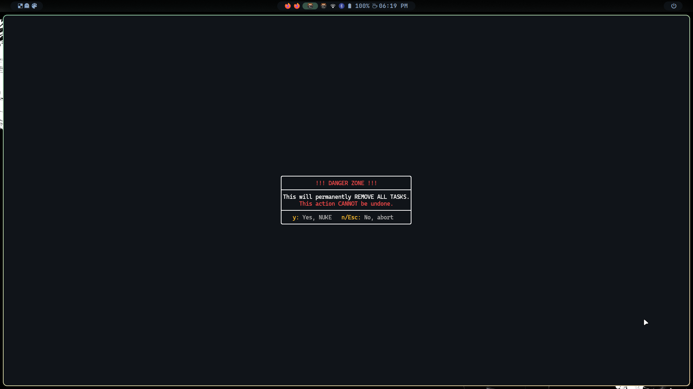

# Priorify


Priorify is a priority-based task manager built in C++, focused on performance, simplicity, and productivity.  
What started as a basic console app has evolved into a modern, keyboard-driven **Terminal User Interface (TUI)** tailored for terminal-heavy workflows.



<details>
<summary><b>Click here to view screenshots (v2.0.0)</b></summary>








</details>

> [!IMPORTANT]  
> **Project Status: v2.0.0 Released; Active Development and Maintenance Phase**  
> Priorify is a personal learning, recreational, and portfolio project developed independently by [me](#author).  
> The application is fully functional and actively used, and will continue to receive new features, improvements, and bug fixes over time.  
> Feedback and discussions are always welcome, but the repository is not intended for external contributions.

---

## Vision

This project is designed to be:
- **Fast:** Minimal overhead with in-memory caching and instant operations.
- **Keyboard-First:** No mouse needed, fully optimised for Vim-style (h/j/k/l) and standard navigation.
- **Focused:** Prioritisation over clutter.
- **Native to Programmers:** Created for programmers who enjoy being in the terminal.

Through this project, I intend to improve the way I track my tasks, solving a personal productivity problem, and I hope it helps others too.

---

## Features (v2.0.0)

- Modern TUI
- **Vim-like Navigation:** `h`/`j`/`k`/`l`
- Custom pill toggles for selecting task status and priority.
- **Task Management:** Add, update, complete, and delete (and clear all) tasks instantly.
- **Calendar Picker:** For date selection (due date) while adding/editing a task.
- **Visual Feedback:** Colour-coded priority bars and active-state highlights.
- **Persistent Storage:** SQLite database safely stores all task data.
- **Performance Optimised:** In-memory caching minimises database polling.
- **About Screen:** Press `?` on the dashboard to see what the app is about.

---

## Technologies Used

- **Language:** C++
- **Database:** SQLite3
- **TUI Framework:** [FTXUI](https://github.com/ArthurSonzogni/ftxui)
- **Build System:** CMake
- **Build Automation:** Bash Scripting

---

## Usage Instructions

### Prerequisites
- CMake
- A C++ compiler supporting C++20 or higher

### On Linux, macOS, and other Unix-like Systems

> This application is Linux-native and developed and tested on Arch Linux.  
> It is expected to work on other Unix-like systems too, including macOS (tested).  

#### 1. Clone the Repository
```bash
git clone https://github.com/schak04/priorify.git
cd priorify
```

#### 2. Install (Recommended)

Run the install script:

```bash
chmod +x scripts/install.sh
./scripts/install.sh
```

Once done, you can launch the app from anywhere in your terminal:

```bash
priorify
```

*(**Note:** Ensure `~/.local/bin` is in your system's PATH)*

<details>
<summary><b>Click here if you need help with it</b></summary>

To add `~/.local/bin` to your PATH, open your shell config file (like `~/.bashrc` or `~/.zshrc`) and add this line at the bottom:

```bash
export PATH="$HOME/.local/bin:$PATH"
```

Then, reload your shell (or just restart your terminal):
```bash
source ~/.bashrc  # or ~/.zshrc
```
</details>

#### Alternative: Build & Run Locally

If you prefer not to install it globally, you can build and run it manually:

```bash
chmod +x scripts/build.sh
./scripts/build.sh
```

Always run the executable from the project root to ensure the database path (`data/tasks.db`) resolves correctly:

```bash
./bin/priorify
```

#### Uninstall

If you ever wish to remove this app from your system, you can run the uninstall script from the cloned repository. It will safely remove the app (and also ask if you want to keep or delete your tasks database):

```bash
chmod +x scripts/uninstall.sh
./scripts/uninstall.sh
```

### Keybindings Guide
- `a`: Add a new task
- `e`: Edit selected task
- `d`: Delete selected task (requires confirmation)
- `D`: Clear all tasks (requires confirmation)
- `c`: Toggle completion status
- `j`/`k` or `Up`/`Down`: Navigate lists and form fields
- `h`/`l` or `Left`/`Right`: Cycle through radio options or should I say... pills (Status/Priority)
- `Enter`: Save / Confirm
- `q`/`Esc`: Quit the app when in the dashboard
- `?`: Open the About screen
- `Spacebar` (when on the Due Date field in the **add/edit-task** screens): Open the calendar picker
- `Esc`: Return to the dashboard when inside the **add/edit-task screens** or **delete/clear-all confirmation screens**

> [!NOTE]  
> The app is not available for Windows yet.  
> However, Windows users can use [WSL (Windows Subsystem for Linux)](https://learn.microsoft.com/en-us/windows/wsl) to run the app.

---

## System Design

### High-Level Design
- **System Architecture:**  


- **UML Use Case Diagram:**  


### Low-Level Design
- **Sequence Diagram:**  


---

## References

### Main
- **C++:** [**cppreference**](https://en.cppreference.com/cpp/language)
- **SQLite:** [**documentation**](https://sqlite.org/docs.html)
- **FTXUI:** [**documentation**](https://arthursonzogni.github.io/FTXUI)
- **CMake:** [**documentation**](https://cmake.org/cmake/help/latest/index.html) and [**tutorial**](https://cmake.org/cmake/help/latest/guide/tutorial/index.html#guide:CMake%20Tutorial)
- **Chrono:** [**GfG**](https://www.geeksforgeeks.org/cpp/chrono-in-c) and [**cppreference**](https://en.cppreference.com/cpp/chrono)

### More
- [**StackOverflow** - **difference between include guards and #pragma once**](https://stackoverflow.com/questions/22193338/what-is-the-difference-between-ifndef-and-pragma-once-and-what-does-the-same)
- [**Choosing between $0 and BASH_SOURCE**](https://stackoverflow.com/questions/35006457/choosing-between-0-and-bash-source)

---

## ASCII Art

> I tried using different sites (such as: https://patorjk.com/software/taag, https://coddy.tech/tools/ascii-art-generator, etc.) to create ASCII art from typed text, but they were all too gigantic, and even when small, they didn't match the image I had in mind. The sites are great though, no complaints. I just wanted the logo to fit within 2 lines, so I used Unicode block elements to manually create the ASCII art myself for the app's name (visible on the dashboard). 
> Characters Used:
> - █ (Full Block: U+2588)
> - ▀ (Upper Half Block: U+2580)
> - ▄ (Lower Half Block: U+2584)

**Reference:** [**WikiPedia - Block Elements**](https://en.wikipedia.org/wiki/Block_Elements)

---

## Author

&copy; 2025-2026 [Saptaparno Chakraborty](https://github.com/schak04).  
All rights reserved.

---
