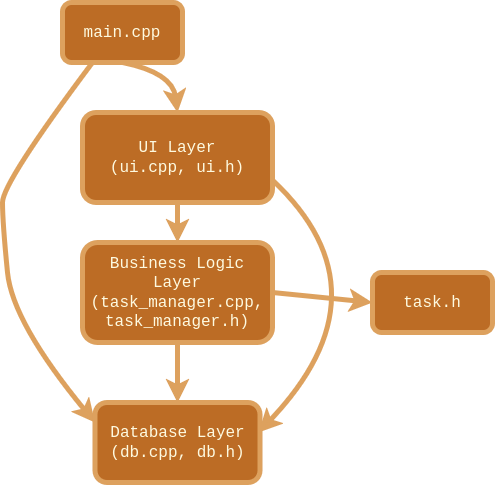
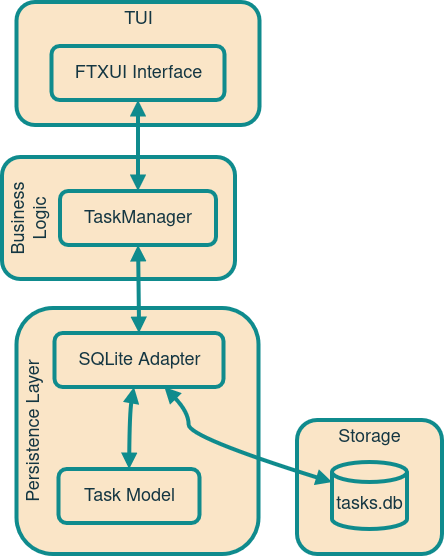
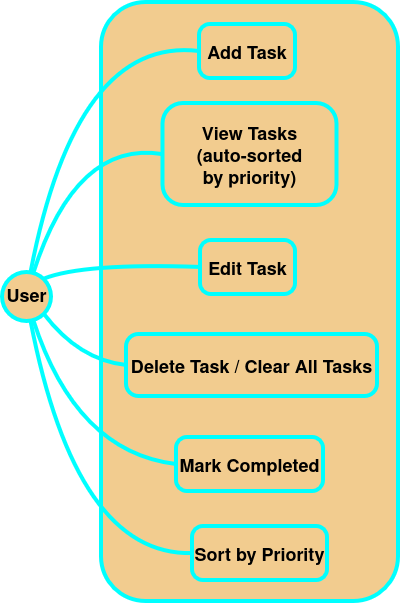
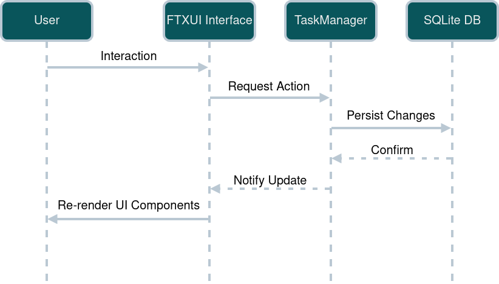

# Priorify


Priorify is a priority-based task manager built in C++, focused on performance, simplicity, and productivity.  
Originally a console application, I am now evolving it into a modern, keyboard-driven TUI (Terminal User Interface), especially for Linux users like myself, with a future GUI planned as an alternative interface.

---

## Vision

This project is designed to be:
- Fast -> minimal overhead, instant operations
- Keyboard-first -> no mouse needed, optimised workflow
- Focused -> prioritisation over clutter
- Native to developers -> built for terminal-heavy environments

Through this project, I intend to improve the way I track my tasks, solving a personal productivity problem, and I hope it helps others too.

---

## Features

- Add, update, complete, and remove tasks
- Display all tasks (ordered by priority)
- Clear all tasks
- In-memory storage using priority queue and vector
- Persistent storage with SQLite
- Cross-platform build scripts

---

## In Progress: TUI Version

The next major step is a feature-rich TUI, built mainly for Linux users like myself (Arch btw).

### Planned TUI Features
- Interactive task list with navigation
- Keyboard shortcuts for all actions
- Color-coded priorities and statuses
- Panels (task view, details, status bar)
- Modal inputs (add/edit tasks)
- Filtering and sorting
- Smooth and efficient screen updates

### Tech Direction
#### Already Existing Tech:
  - Language: C++
  - DB: SQLite
#### Planned for TUI:
- TUI Library: FTXUI
- Architecture:
    - Core logic (task manager)
    - Persistence layer (SQLite)
    - UI layer (TUI)

---

## Technologies Used

- Language: **C++**
- C++ **Standard Template Library (STL)**
- Database: **SQLite**
- Terminal UI: **[FTXUI](https://github.com/ArthurSonzogni/ftxui)**
- Build System: **[CMake](https://cmake.org/)**

---

## How to Use (for now, before the new TUI improvements)

### On Linux (and Unix-like Operating Systems, macOS)

#### Clone the Repository
```bash
git clone https://github.com/schak04/priorify.git
cd priorify
```

#### Make the build script executable (only once)

```bash
chmod +x scripts/build.sh
```

**Build:**

```bash
./scripts/build.sh
```

**Run:**

```bash
./bin/priorify
```

### On Windows (Prebuilt App Bundle)

If you're a Windows user and just want to **run the exe**, follow these steps:

**Either:**

1. **Go to the [Releases](https://github.com/schak04/priorify/releases) section of this repo.**
2. **Download the installer `priorify_setup.exe`** and **install the app bundle** using it.

**Or:**

1. **Go to the [Releases](https://github.com/schak04/priorify/releases) section of this repo.**
2. **Download the `.zip` bundle** attached to the latest release.
3. **Extract** the zip file.
4. Open the extracted folder and go to the `bin/` directory.
5. **Double-click `priorify.exe`** to run the app.

> **Do not move the EXE out of the `bin/` folder.**

---

## Project Structure



---

## System Design

### <ins>High-Level Design</ins>

- **System Architecture:**  


- **UML Use Case Diagram:**  


### <ins>Low-Level Design</ins>

- **Sequence Diagram:**  


---

## Current Status

- Core features implemented
- Fully functional CLI app
- Refactored for upcoming TUI (using FTXUI)
- Migrated to CMake build system
- Working on new TUI using FTXUI
- GUI integration will be done eventually as an alternative interface (using Qt)

---

## Author

&copy; 2025-2026 [Saptaparno Chakraborty](https://github.com/schak04).  
All rights reserved.

---
